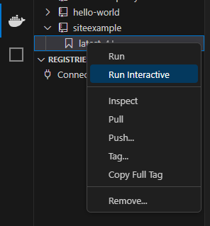

# Site Example

This is a Flask + tailwind + dash + plotly site, the dash plot is embeded rather than in control.

## References
+ Applicaiton Factory Pattern - https://flask.palletsprojects.com/en/3.0.x/tutorial/factory/
+ Flask Application structure - https://hackersandslackers.com/flask-application-factory/
+ Flowbite - https://flowbite.com/docs/getting-started/flask/
+ Flask + Tailwind - https://github.com/themesberg/tailwind-flask-starter
+ Flask + Dash - https://github.com/toddbirchard/plotlydash-flask-tutorial/
+ Flask + Dash - https://hackersandslackers.com/plotly-dash-with-flask/
+ Flask + Dash - https://github.com/tzelleke/flask-dash-app/tree/main
+ Tailwind standalone - https://tailwindcss.com/blog/standalone-cli
+ Tailwind installation - https://tailwindcss.com/docs/installation
+ Tailwind cli - https://www.dadonk.com/installing-tailwind-cli-for-stand-alone-site/
+ Tailwind playground - https://github.com/tailwindlabs/tailwindcss-playground
+ Plotly embed as div - https://plotly.com/python-api-reference/generated/plotly.io.to_html.html

## Design

### Atomic Design 
+ https://atomicdesign.bradfrost.com/
+ https://bootcamp.uxdesign.cc/building-design-systems-with-atomic-design-fd21e86f34c5
+ https://www.webstacks.com/blog/atomic-design-methodology
                 

## Development Tools
### Pyhton + VS Code + Docker 
+ https://code.visualstudio.com/docs/containers/debug-python
+ https://chopcoding.com/flask-docker-vscode-how-to-simplify-debugging-and-improve-your-development-experience
### VS Code + Docker 
+ https://code.visualstudio.com/docs/containers/reference
+ https://code.visualstudio.com/docs/containers/overview
### Flask + python + VS Code
+ https://code.visualstudio.com/docs/python/tutorial-flask

### Actions and tasks
+ Debug using (ctrl+shift+d) - https://code.visualstudio.com/docs/editor/debugging
    - select thre Docker:Python - Flask Live
    - This allows breakpoints in python code as well as changes to files to 'live' changed in the image
+ Run Tailwind Css generation (ctrl+p task docker-run:  tailwind css compile) - https://code.visualstudio.com/docs/editor/tasks
    - Look in the .vscode/tasks.json for all the tasks that can be run
    - The tailwind css runs a tool that is in the docker image to convert the style.css to main.css
+ Run a terminal in the docker image
    - A terminal with a bash shell can be started in the docker image 
    - Click on the 'docker' whale and select the docker image `siteexample`
    - Right click the image tag `latest` then select `Run Interactive` 
    - 

## Issues
### Error Message: Debug Adapter Execution not provided
This is an error caused by the host not having python installed or available in the path for VS Code. 
Install python and check that code can open a py file and have an interpeter. (Check the bottom right)

